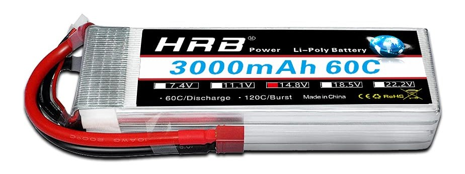

<a name="readme-top"></a>
# EMBEDDED SOFTWARE FOR THE INTERNET OF THINGS 

| NAME               | MATRICOLA | MAIL                                 |
|--------------------|-----------|--------------------------------------|
| Andrea Costantino  | 123456    | evelin.begher@studenti.unitn.it      |
| Nicolo' Belle'     | 123456    | evelin.begher@studenti.unitn.it      |
| Riccardo Bassan    | 123456    | evelin.begher@studenti.unitn.it      |
| Evelin Begher      | 235188    | evelin.begher@studenti.unitn.it      |

## Indice
- [project overview](#project-overview)
- [requirements](#requirements) 
- [documentation](#documentation)
  - [libraries](#libraries)
  - [function](#function)
-  [project description](#project-description)
- [system and peripherals initialization](#system-and-peripherals-initialization)
- [dynamic day and night mode](#dynamic-day-and-night-mode)
- [user interface](#user-interface)
  - [pin](#pin)
  - [keypad](#keypad)

## PROJECT OVERVIEW
<br>
This project implements a <b>SECURE KEYLESS DOOR UNLOCKING SYSTEM</b> based on a <b>PIN code</b>, designed for IoT applications in embedded environments. The user can enter a secret code using a <b>virtual numeric keypad</b> displayed on screen, navigable via an analog joystick. Access is granted only if the entered PIN is correct, mimicking the behavior of an electronic lock. After three consecutive incorrect attempts, the system locks for security reasons.  <br><br>
To enhance user experience and environmental adaptability, the device also includes a <b>light sensor</b> that enables automatic switching between day and night modes by changing the graphical interface colors. All interaction is managed through a color display connected via SPI and updated dynamically. <br><br>
This project serves as a complete demonstration of human-machine interaction (HMI), analog input handling, embedded security, and graphical visualization on a microcontroller. It is entirely developed for the MSP432P401R platform.

## REQUIREMENTS

* <b>HRB LIPO BATTERY </b> <br>
A rechargeable battery that provides electric power for the whole system. <br>
<b>USE </b>: to power the servo motor, the voltage converter, and all the electronic components of the project
 

* <b>DIGITAL SERVO MOTOR MG995 </b><br>
A digital motor that can turn to specific angles with high precision and strength, thanks to its metal gears. <br>
<b>USE </b>: to move the locking mechanism of the door, allowing it to open and close automatically
 
  
* <b>LM2596 STEP-DOWN CONVERTER </b><br>
An electronic module that reduces a higher voltage to a lower and safer value. <br>
<b>USE </b>: to make sure that the LiPo battery did not send too much voltage to the sensitive parts, like the controller and the servo motor. <br>
 
  
* <b>TEXAS INSTRUMENTS MSP432P401R MICROCONTROLLER</b> <br>
This is a small computer on a chip that controls the whole system.It reads signals, runs the program, and tells other parts what to do. <br>
<b>USE </b>:to manage the motor, read sensors, and control the door lock automatically. <br>

   
* <b>3D PRINTING </b> <br>
A process that creates plastic parts by adding one layer at a time, based on a digital design <br>
<b>USE </b>: to make the custom parts that hold the motor, support the lock, and connect different parts of the door structure.
  
*  <b>LOCK, HANDLE, AND VARIOUS TOOLS FOR THE DOOR STRUCTURE </b> <br>
Mechanical parts like the lock and handle, plus tools used to assemble everything. <br>
<b>USE </b>: to build the physical structure of the door and to install the system, making sure it worked properly and securely.


## DOCUMENTATION 

### LIBRARIES
#### Included libraries
```c
#include <ti/devices/msp432p4xx/driverlib/driverlib.h>
#include <ti/devices/msp432p4xx/inc/msp.h>
#include <ti/grlib/grlib.h>
#include "HAL_OPT3001.h"
#include "LcdDriver/Crystalfontz128x128_ST7735.h"
#include <stdio.h>
#include <string.h>
```
  * <b>DriverLib & MSP headers </b> → Provide access to peripherals like GPIO, ADC, timers.
  * <b>GRLib </b> → TI’s graphics library for drawing on the display.
  * <b> OPT3001 HAL </b> → Interface for the ambient light sensor.
  * <b> LCD Driver </b> → Manages the ST7735 128x128 color displa

#### Constants and Configuration 
```c
#define CENTER     8192
#define THRESHOLD  2000
#define PIN_LENGTH 4
#define MAX_LENGTH 6
#define LIGHT_THRESHOLD 50
```
* <b>CENTER</b> &rarr; Neutral joystick ADC value.
* <b>THRESHOLD</b>  &rarr; Dead zone to avoid accidental movements.
* <b>PIN_LENGTH</b>  &rarr; Length of the correct PIN.
* <b>MAX_LENGTH</b>  &rarr; Max characters buffer can hold (e.g., 4 + control chars like "x" or "E").
* <b>LIGHT_THRESHOLD</b>  &rarr; Ambient light threshold for day/night mode switching.

### FUNCTION

## PROJECT DESCRIPTION
### SYSTEM AND PERIPHERALS INITIALIZATION
### DYNAMIC DAY AND NIGHT MODE
### USER INTERFACE
#### PIN
#### KEYPAD

## LINKS 
* youtube: 
* power point:

<p align="right">(<a href="#readme-top">back to top</a>)</p>

 


